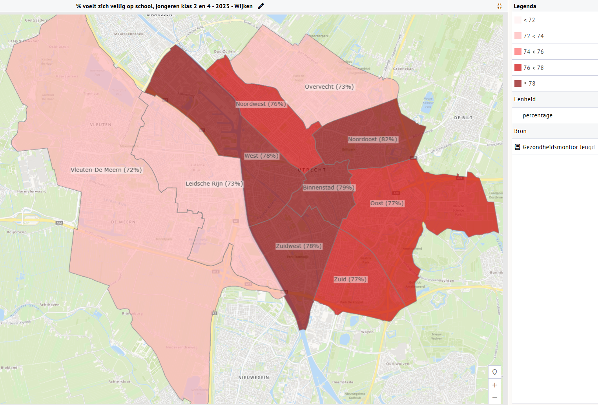
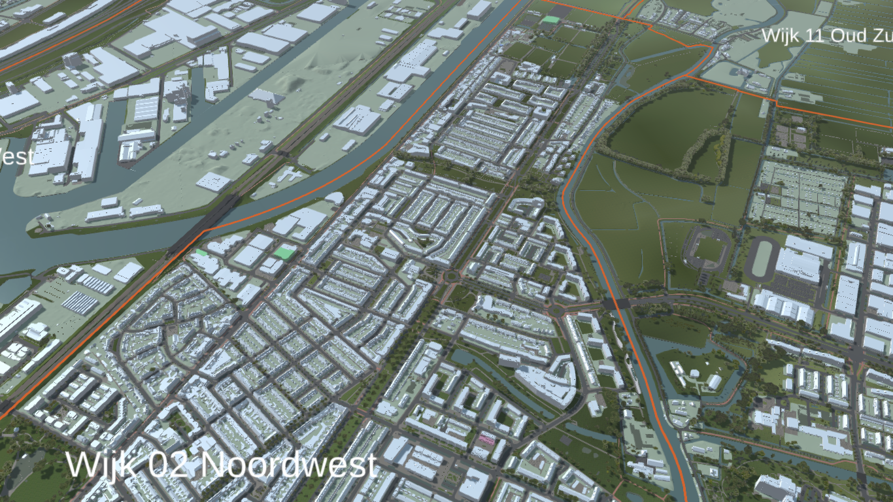
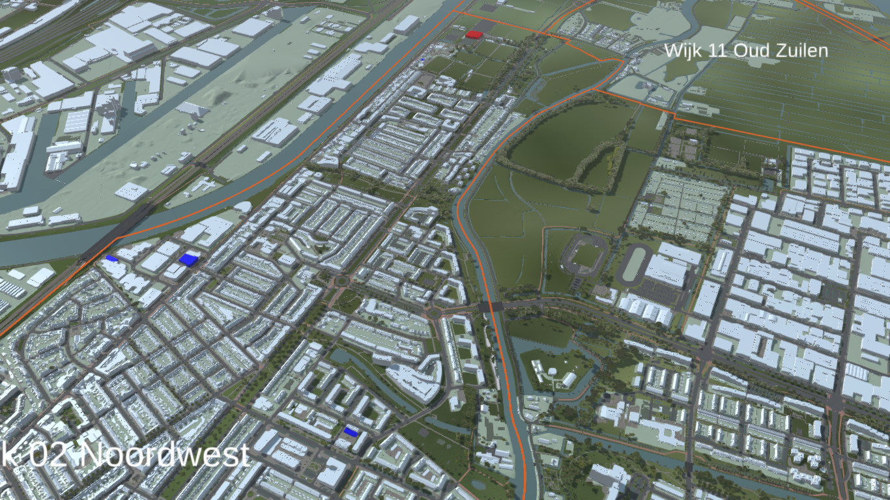

\newpage

```{r}
#| label: load_libraries
#| echo: false

library(readxl) # for read_excel
library(tidyverse) # for data manipulation
library(sf) 
library(readr) # for read_delim
library(here) # for file paths
```

## Doelgroep

### Utrecht in Cijfers - Hoe groot is de doelgroep?

Eerst heb ik dit geprobeerd m.b.v. CBS data (zie @sec-bijlage1: Bijlage 1), maar deze data heeft beperkte informatie over de leeftijden van de meisjes in de wijk Zuilen). Deze sectie laat m.b.v. Utrecht in Cijfers zien hoeveel meisjes er in de wijk Zuilen zijn en hoe deze verdeeld zijn over verschillende leeftijdscategorieën.

De [Databank](https://utrecht.incijfers.nl/jive) van Utrecht in Cijfers heeft meer gedetailleerde informatie over de leeftijdsverdeling van meisjes in de wijk Zuilen. In @fig-doelgroep_grootte2 is de leeftijdsverdeling van meisjes in de wijk Zuilen te zien. Hieruit blijkt dat er in de wijk Zuilen relatief veel meisjes van 19-21 jaar zijn.

```{r}
#| label: fig-doelgroep_grootte2
#| echo: false
#| fig-cap: "Aantal vrouwen per leeftijd in de wijk Zuilen"

# import csv
data_uic <- read.delim(file = here("Doelgroep en Voorzieningen/Utrecht-in-Cijfers_bevolking-naar-geslacht-en-leeftijd-vrouwen-2024-Buurten.csv"), sep = ";", header = TRUE)
colnames(data_uic) <- c("Buurt", "0", "1", "2", "3", "4", "5", "6", "7", "8", "9", "10", "11", "12", "13", "14", "15", "16", "17", "18", "19", "20", "21", "totaal")
zuilen_leeftijd <- data_uic %>%
  filter(Buurt == "Buurten totaal") %>%
  select(-c(Buurt, totaal))
zuilen_leeftijd <- as.data.frame(t(zuilen_leeftijd))
colnames(zuilen_leeftijd) <- c("aantal")
zuilen_leeftijd$aantal <- as.numeric(zuilen_leeftijd$aantal)
zuilen_leeftijd$leeftijd <- 0:21
zuilen_leeftijd$leeftijd <- factor(zuilen_leeftijd$leeftijd, levels = 0:21)  # Ordering the age levels explicitly

ggplot(zuilen_leeftijd, aes(x = leeftijd, y = aantal)) +
  geom_bar(stat = "identity", fill = "skyblue", color = "black") +
  labs(x = "Leeftijd", y = "Aantal vrouwen") +
  theme_minimal() 
```

Nu kunnen we de leeftijden opdelen naar verschillende categorieën:

-   De wijk Zuilen kent `r as.numeric(filter(zuilen_leeftijd, leeftijd %in% 12:18) %>%   summarise(aantal = sum(aantal)))` meisjes in de leeftijdscategorie van 12-18
-   De wijk Zuilen kent `r as.numeric(filter(zuilen_leeftijd, leeftijd %in% 16:21) %>%   summarise(aantal = sum(aantal)))` meisjes in de leeftijdscategorie van 16-21

Deze data geeft ons een beter beeld van de grootte van de doelgroep ten opzichte van de CBS data.

## Beschikbare Data over Voorzieningen

### CBS Data

De [2023 versie](https://opendata.cbs.nl/statline/#/CBS/nl/dataset/85830NED/table?dl=AE6FE) van de kerncijfers wijken en buurten van het CBS bevat ook informatie over de voorzieningen in de wijk Zuilen:

-   Afstand tot grote supermarkt
-   Afstand tot café
-   Afstand tot restaurant
-   Afstand tot bibliotheek
-   Afstand tot zwembad
-   Afstand to bioscoop

### Utrecht in Cijfers

De [Databank](https://utrecht.incijfers.nl/jive) van Utrecht in Cijfers heeft ook informatie over de voorzieningen in de subwijk Zuilen (of de de gehele wijk Noordwest of de buurten van Zuilen). Utrecht in Cijfers is een compilatie van verschillende data bronnen, waaronder de inwonersenquete, de veiligheidsmonitor, de jeugdmonitor en de CBS data. Zo is er bijvoorbeeld informatie over de volgende voorzieningen. Hierbij is het belangrijk om op te merken dat het grotendeel wat bestaat uit de inwonersenquete en CBS data die allebei ingevuld worden door participanten van 18 jaar en ouder: en dus niet door de doelgroep!

#### Sport

Er is data beschikbaar over de tevredenheid over sportvoorzieningen in de buurt of stad.

#### Cultuur

De algemene tevredenheid over culturele voorzieningen in (a) de subwijken Zuilen-west en (b) Zuilen-noord/-oost was in 2023 redelijk dichtbij de gemiddelde tevredenheid in de hele stad Utrecht (zie @tbl-cultuur_tev). Wel lijkt men iets meer tevreden te zijn in Zuilen-west vergeleken met Zuilen-noord/-oost, al is het niet duidelijk of dit verschil significant is (zie ook Sociale Propositie Noordwest p. 33 voor een infographic m.b.t. de beleving van bewoners op basis van 2024 data).

```{r}
#| label: tbl-cultuur_tev
#| echo: false

cultuur_tev <- read.csv(here("Doelgroep en Voorzieningen/UIC_tevredenheid_culturele_voorzieningen_buurt_2023_deel.csv"), sep = ";")
colnames(cultuur_tev) <- c("Regio", "% zeer tevreden", "% neutraal", "% zeer ontevreden")
knitr::kable(cultuur_tev, caption = "Procent inwoners dat tevreden is over culturele voorzieningen in de buurt in 2023")
```

De algemene cultuurdeelname in Zuilen-west en Zuilen-noord/-oost zijn respectievelijk 94% en 79%; vergeleken met een gemiddelde cultuurdeelname van 89% over heel Utrecht genomen. Er lijkt dus mogelijk een positieve correlatie te zijn tussen de cultuurdeelname en de tevredenheid over culturele voorzieningen. Dit kan bijvoorbeeld komen doordat de aanwezigheid van culturele voorzieningen/activiteiten zowel meer deelname als meer tevredenheid veroorzaakt. (oftewel, aanwezigheid van culturele voorzieningen is een confounder).

Specifieker gezien is er ook informatie over de deelname aan verschillende culturele activiteiten in 2023: bezoek muziek, dans, toneel, film, museum, festival, restaurant (zie @tbl-cultuur_deelname). Zo blijkt dat inwoners uit Zuilen-west gemiddeld een hogere deelname hebben aan *alle* gemeten culturele activiteiten vergeleken met heel Utrecht. Daarentegen is de deelname aan *alle* culturele activiteiten in Zuilen-noord/-oost lager dan het gemiddelde in Utrecht. Dit geeft aan dat er duidelijke verschillen zijn binnen de wijk Zuilen. Nu roept dit natuurlijk de vraag op of de verschillen in tevredenheid en deelname direct veroorzaakt wordt door het (gebrek aan) aanbod, wat wel aannemelijk lijkt.

```{r}
#| label: tbl-cultuur_deelname
#| echo: false

cultuur_deelname <- read.csv(here("Doelgroep en Voorzieningen/UIC_deelname_culturele_activiteiten_2023_Subwijken_deel.csv"), sep = ";")
cultuur_deelname <- t(cultuur_deelname)
# save and remove first row
# reg_names <- as.character(cultuur_deelname[1,])
cultuur_deelname <- as.data.frame(cultuur_deelname[-1,])
colnames(cultuur_deelname) <- c("Zuilen-west", "Zuilen-noord/-oost", "Utrecht")
row.names(cultuur_deelname) <- c("klassieke muziek", "popmuziek of dance", "muziektheater, musical of opera", "overige muziek", "toneel of dans", "cabaret of stand up comedian", "naar de film", "museum", "festival of cultureel evenement", "restaurant of cafe")

knitr::kable(cultuur_deelname, caption = "Procent inwoners dat verschillende culturele activiteiten bezoekt in 2023")
```

#### Veiligheid

Bij gesprekken door Erna en Fleur met onderzoekers uit Rotterdam kwam naar boven dat de veiligheidsbeleving erg sturend is in het gedrag van meiden in en gebruik van de buitenruimte. Er zijn drie databronnen die informatie geven over de veiligheidsbeleving in de wijk Zuilen: de inwonersenquete (volwassen inwoners), de jeugdmonitor (kinderen 10-12 jaar) en de gezondheidsmonitor jeugd (GMJ, jongeren klas 2 en 4). Laten we nu laten zien met kaarten hoe de veiligheidsbeleving in Zuilen en Noordwest zich verhoudt tot de rest van Utrecht. 

Laten we eerst kijken hoe de veiligheidsbeleving is onder volwassenen in de wijk Zuilen door te kijken naar de inwonersenquete. Voor deze enquete is data beschikbaar op wijk, subwijk en buurtteam niveau. Hieruit komt naar voren dat van de inwoners in Zuilen (1) in het algemeen 43% zich soms en 3% zich vaak onveilig voelt vergeleken met 42% en 4% in Utrecht; en (2) in eigen buurt 35% zich soms en 6% zich vaak onveilig voelt vergeleken met 34% en 4% in Utrecht. Dit geeft aan dat de veiligheidsbeleving in Zuilen iets lager is dan in Utrecht. Het is wel interessant dat wanneer we verder inzoomen naar het subwijk niveau, dat we vinden dat 28% zich soms onveilig voelt in Zuilen-west en 42% in Zuilen-noord/-oost. Dit geeft aan dat alhoewel er niet zo zeer verschillen zitten in de algemene veiligheidsbeleving tussen Zuilen en Utrecht, er wel duidelijke verschillen zijn tussen de subwijken van Zuilen. De algemene bevindingen uit deze data komen overeen met het scheidslijnen rapport van de gemeente Utrecht, wat gepubliceerd was in 2023 (zie [rapport](https://utrecht-monitor.nl/scheidslijnen-utrecht/26-veiligheidsbeleving)); en de 2024 data gebruikt voor de Sociale Propositie Noordwest (p. 33).

Met betrekking tot de Jeugdmonitor Utrecht 2023, wat gaat om kinderen van 10-12 jaar, is er ook informatie over de veiligheidsbeleving (alleen op wijkniveau), waaruit blijkt dat de verschillen tussen wijk Noordwest en Utrecht niet erg groot zijn (zie @tbl-jeugdmonitor).

|   | in school-huis verkeer | in de klas | op/rond school | op speelplekken |
|--------------|-------------------|--------------|--------------|--------------|
| Wijk Noordwest | 23% | 16% | 24% | 16% |
| Utrecht | 25% | 17% | 22% | 16% |

: Percentage Onveiligheidsgevoel op Verschillende Plekken onder Kinderen van 10-12 jaar {#tbl-jeugdmonitor}

Met betrekking tot de gezondheidsmonitor jeugd (GMJ) 2023, wat gaat om jongeren uit klas 2 en 4, is ook informatie over de veiligheidsbeleving (alleen op wijkniveau). Hieruit blijkt dat de 76% van de jongeren uit Noordwest zich veilig voelt op school vergeleken met 75% over heel Utrecht genomen. Dit geeft aan dat de verschillen tussen wijk Noordwest en Utrecht niet erg groot zijn (zie @fig-gmj). Maar let wel dat dit niet gaat om veiligheidsbeleving in de openbare ruimte.

{#fig-gmj}

Verder is er ook informatie over overlast van jongeren en of de gemeente voldoende optreed tegen verschillende soorten overlast (bijv. vervuiling van openbare ruimte, drank- en drugsoverlast).

#### Mobiliteit

Er is ook data beschikbaar over de vervoersongelijkheid in Utrecht. Zo is er informatie over de bereikbaarheid van verschillende van bijvoorbeeld werklocatie, onderwijslocatie en huisarts.

#### Openbare Ruimte & Groen

Volgens data uit 2023 was het algemeen buurtoordeel voor de openbare ruimte in a) Zuilen-west en b) Zuilen-noord/-oost 7.2 en 6.2 respectievelijk uit 10; vergeleken met een gemiddelde van 7.3 over heel Utrecht genomen (soortgelijke statistieken werden vermeld in de 2024 data gebruikt voor de Sociale propositie Noordwest, p. 33). Dit geeft aan dat de algemene tevredenheid over de openbare ruimte in Zuilen-west hoger is dan in Zuilen-noord/-oost.

Specifieker gezien is er ook informatie over de tevredenheid over jongerenvoorzieningen in de buurt in 2023. Hieruit blijkt dat inwoners uit zowel a) Zuilen-west als b) Zuilen-noord/-oost minder tevreden zijn over de jongerenvoorzieningen in de buurt vergeleken met het gemiddelde in Utrecht (zie @tbl-tevr_jongeren). In Zuilen-noord/-oost is de tevredenheid iets lager dan in Zuilen-west, maar het is niet duidelijk of dit verschil significant is. En let wel, deze vragenlijst was niet ingevuld door jongeren zelf, maar door participanten van 18 jaar en ouder ([inwonersenquete](https://utrecht.incijfers.nl//info/Bronbeschrijving%206_Inwonersenqu%C3%AAte%202023.htm)).

```{r}
#| label: tbl-tevr_jongeren
#| echo: false

tev_jongerenvoorz <- read.csv(here("Doelgroep en Voorzieningen/UIC_tevredenheid_jongerenvoorzieningen_subwijk_2023.csv"), sep = ";")
knitr::kable(tev_jongerenvoorz, caption = "Procent inwoners dat tevreden is over jongerenvoorzieningen in de buurt in 2023")
```

Verder is er ook nog 2023 data over tevredenheid in de buurt over groen, parken, verlichting en speelgelegenheid (zie ook de Sociale Propositie Noordwest, p. 33).

-   Zo is 83% van de inwoners uit Zuilen-west tevreden over het park in de buurt, terwijl dit percentage in Zuilen-noord/-oost 67% is; vergeleken met 72% over heel Utrecht. Dit geeft aan dat de tevredenheid over het park in de buurt in Zuilen-west hoger is dan in Zuilen-noord/-oost en heel Utrecht, wat geen grote verassing is omdat het Julianapark in Zuilen-west ligt.
-   De tevredenheid over groen in de buurt is erg vergelijkbaar tussen Zuilen-noord/-oost (69% tevreden) en Utrecht (68% tevreden), maar ligt iets lager in Zuilen-west (59% tevreden).
-   De tevredenheid over verlichting in de buurt is 82% in Zuilen-west, 76% in Zuilen-noord/-oost en 77% in Utrecht. Dit geeft aan dat de tevredenheid over verlichting in de buurt in Zuilen-west hoger is dan in Zuilen-noord/-oost en Utrecht.
-   De tevredenheid over speelgelegenheid in de buurt is 58% in Zuilen-west, 55% in Zuilen-noord/-oost en 60% in Utrecht. Dit geeft aan dat de tevredenheid over speelgelegenheid in Zuilen iets lager is dan in heel Utrecht.

#### Onderwijs & Vaardigheden

Er is informatie over het aantal leerlingen naar woonlocatie en wijk onderwijsinstelling uit het schooljaar 2022-2023. Hieruit blijkt dat

-   relatief veel jongeren van de wijk Noordwest gaan naar voortgezet onderwijs in een andere wijk: slechts 10.8% van de leerlingen van de wijk Noordwest blijft in de wijk en 89.2% gaat naar voortgezet onderwijs in een andere wijk.
-   relatief weinig jongeren in die in de wijk Noordwest op het voortgezet onderwijs zitten komen uit Noordwest: slechts 28.8% van de leerlingen op het voortgezet onderwijs in Noordwest komt uit Noordwest en 71.2% komt uit een andere wijk.

Helaas is deze openbare data enkel op wijkniveau beschikbaar, maar misschien heeft de gemeente Utrecht deze data ook op buurt niveau. Verder is er ook informatie over inclusie en sociale veiligheid bij jongeren, bijvoorbeeld: gepest op internet, gediscrimineerd.

### Gezondheidsmonitor Jeugd

[De Gezondheidsmonitor Jeugd (GMJ)](https://volksgezondheidsmonitor.nl/uitgaven/samenvatting-gezondheidsmonitors-kinderen-jongeren) wordt sinds 2019 tweejaarlijks in Utrecht uitgevoerd door de afdeling Volksgezondheid van de gemeente Utrecht, in samenwerking met de GGD regio Utrecht en GGDGHOR Nederland. De GMJ is een vragenlijstonderzoek onder leerlingen uit de tweede en vierde klas van het reguliere Utrechtse voortgezet onderwijs.

Dus in tegenstelling tot de statistieken besproken in de vorige sectie (Utrecht in Cijfers, inwonersenquete), is de GMJ een vragenlijstonderzoek *onder jongeren zelf*. Helaas zijn alleen samenvattende statistieken beschikbaar en dus niet de ruwe/granulaire data. Hierdoor kunnen we alsnog niet uitspraken doen over jongeren in Zuilen.

Floris heeft contact opgenomen met de afdeling Volksgezondheid, waaruit bleek dat er 80 meiden in de enquête zaten die in de wijk Zuilen wonen; en dat we van een groep gelijk aan of groter dan 80 mogelijk data kunnen opvragen voor specifieke items. In het jaar 2023 waren er 232 items. Items hieruit die ons wellicht wat kunnen vertellen over gedrag en voorkeuren rondom publieke ruimte zijn:

Als jongeren bepaalde activiteiten buiten schooltijd doen, zullen ze in die tijd in ieder geval niet rondhangen in de buurt.

-   Percentage jongeren dat 2 of meer dagen per week buiten schooltijd muziek maakt, zingt, speelt toneel, tekent/schildert of fotografeert bij een vereniging
-   Percentage jongeren dat 4 of meer dagen per week buiten schooltijd muziek maakt, zingt, speelt toneel, tekent/schildert of fotografeert bij een vereniging
-   Percentage jongeren dat minder dan 1 dag per week buiten schooltijd activiteiten bij een ander soort vereniging of organisatie doet
-   Percentage jongeren dat wekelijks buiten schooltijd activiteiten bij een ander soort vereniging of organisatie doet
-   Percentage jongeren dat 2 of meer dagen per week buiten schooltijd activiteiten bij een ander soort vereniging of organisatie doet
-   Percentage jongeren dat 4 of meer dagen per week buiten schooltijd activiteiten bij een ander soort vereniging of organisatie doet

Als jongeren het leuk vinden op school, zouden ze hier misschien eerder blijven na schooltijd.

-   Percentage jongeren dat het (hartstikke) leuk vindt op school
-   Percentage jongeren dat school niet leuk of vreselijk vindt

Als jongeren zich veiligvoelen op school, zouden ze hier misschien eerder blijven na schooltijd.

-   Percentage jongeren dat zich veilig voelt op school

Als jongeren vaak laat thuis zijn, kan dit de vraag oproepen of ze buiten zijn of niet en waarom.

-   Percentage jongeren dat 1 dag of meer na 22.00 uur niet thuis is

Als jongeren veel tijd doorbrengen met hun ouders/verzorgers, zullen ze misschien niet rondhangen in de buurt.

-   Percentage jongeren waarvan ouders/verzorgers veel tijd met jongere doorbrengen

Het zou interessant zijn om te zien of jongeren zich vaak gediscrimineerd voelen (omtrent geslacht), aangezien dit waarschijnlijk invloed heeft op gevoel van veiligheid en wellicht een rede kan zijn dat meiden niet vaak buiten zijn.

-   Percentage jongeren dat zich de afgelopen 12 maanden vaak gediscrimineerd voelt

-   Percentage jongeren dat zich gediscrimineerd heeft gevoeld, waarondervanwege geslacht of gender

## Voorzieningen Geschikt voor Nederland 3D

### Voorbeeld 1: Sportscholen

#### Data Verzamelen

Het is wellicht ook interessant om te kijken naar de sportscholen in de wijk Zuilen en om hierbij het onderscheid te maken tussen sportscholen die (1) gemengd zijn, (2) alleen voor mannen en (3) alleen voor vrouwen. Na het vinden van deze sportscholen kunnen we deze linken aan het BAG-register om vervolgens ze gekleurd weer te geven in Nederland3D.

Ik heb op google maps de volgende zoektermen gebruikt: "sportschool", "sporten". Vervolgens heb ik informatie m.b.t. de sportscholen in de wijk Zuilen in een csv bestand gezet. Hierbij het ik genoteerd: de naam van de sportschool, het adres, het type sportschool, of de sportschool gemengd is of niet, of er vooral mannen of vrouwen bij de sportschool sporten en eventuele opmerkingen. Deze laatste twee variabelen waren niet makkelijk te bepalen aangezien dit vaak niet duidelijk op de website van de sportschool stond. De variabele "Vooral", die aangeeft of er vooral mannen of vrouwen sporten, is vooral gebaseerd op de foto's die op de website van de sportschool staan. Deze variabele leek mij nuttig omdat alhoewel een sportschool die Yoga geeft gemengd kan zijn, maar in het algemeen vooral door vrouwen bezocht wordt, wat een invloed heeft op de soort sfeer van een sportschool. Maar misschien is het een idee om deze laatste twee variabelen te verifiëren bij de sportscholen zelf.

Het is opvallend dat er redelijk weinig sportscholen zijn in Zuilen en dat er juist een aantal net over de grens van de wijk zijn (bijvoorbeeld in Nieuw Engeland, Schepenbuurt zijn er 5 sportscholen). Een van deze sportsscholen, [ALLIN Fitness](https://allinnfitness.nl/sportschool-utrecht/) zegt in Zuilen te zitten, maar dit is volgens de buurtgrenzen niet het geval.

```{r}
#| label: tbl-sportscholen
#| echo: false

Sportscholen_Zuilen <- read_delim(here("Doelgroep en Voorzieningen/Sportscholen-Zuilen.csv"), 
    delim = ";", escape_double = FALSE, trim_ws = TRUE)
Sportscholen_Zuilen <- Sportscholen_Zuilen %>%
  select(-c(Adres, "BAG-Pand id's", Opmerking))

knitr::kable(Sportscholen_Zuilen, caption = "Sportscholen in de wijk Zuilen", digits = 0)
```

Van deze sportscholen/sportvereningen is "BeachVolleyball Utrecht" dicht tot april en zijn er twee sportscholen die vooral/alleen richten op personal training, wat me niet erg relevant lijkt voor dit vraagstuk. Als we deze weghalen houden we over:

```{r}
#| label: tbl-sportscholen2
#| echo: false

verwijder_sportschool <- c("Domcity Personal Training - Personal Trainer Utrecht", "Lucia Personal Training", "BeachvolleybalUtrecht")

Sportscholen_Zuilen_fil <- Sportscholen_Zuilen %>%
  filter(!Naam %in% verwijder_sportschool)

knitr::kable(Sportscholen_Zuilen_fil, caption = "Relevante Sportscholen in de wijk Zuilen", digits = 0)
```

#### Linken adressen aan het BAG-register

Door te addressen in te voeren in de [BAG Viewer](https://bagviewer.kadaster.nl/lvbag/bag-viewer) kunnen we de BAG-pan id's van de sportscholen vinden. Helaas is hierbij een probleem dat de volgende sportvereningen allen hetzelfde adres en dus ook BAG-id delen:

-   Zuilense Tennis Club
-   BeachVolleybalUtrecht (eerder al verwijdert i.v.m. dicht tot april)
-   H.M.S
-   Handbal Domstad

Dus als we iets willen inkleuren hier, zal het of 1 vereniging moeten zijn of een gemiddelde. Maar beiden lijken mij ver van optimaal. Desalnietemin, om de visualizatie weer te geven in Nederland3D, verwijder ik nu H.M.S. en Zuilense Tennis Club, zodat alleen Handbal Domstad gelinked is aan dit BAG-pand id. Dit is namelijk de enige entry die gescheiden heeft. Na het verzmalen van deze data, is het belangrijk vast te stellen wat voor informatie de Nederland3D en/of Utrecht3D omgeving accepteerd.

#### Data Importeren in Nederland3D en Utrecht3D

Netherlands3D accepteerd een dataset of link in "GeoJSON of WFS formaat" ([Netherlands3D](https://netherlands3d.eu/#wat-is-netherlands3d)). En de "Gebouwen kleuren" functie in Netherlands3D ...

> "Maakt het mogelijk om een CSV bestand in te laden met daarin een kolom BAG-Pand id's en een kolom kenmerken. De BAG Pand id's uit de CSV worden gebruikt om een koppeling met de 3D BAG paneden uit de viewer te maken om vervolgens het bijbehorende kernmerk te gebruiken om panden te kleuren. Aan elk onderscheidend kenmerk wordt een kleur toegewezen welke zichtbaar wordt gemaakt in de viewer." (instellingen $\to$ functionaliteiten $\to$ Gebouwen kleuren)

Helaas is hier geen voorbeeld beschikbaar van wat de data format kan zijn. Als ik bijvoorbeeld een kolom "BAG-Pand id's" en een kolom "Kenmerken" heb, geeft hij geen verloop in kleuren weer. Arjan Koelewijn heeft mij een voorbeeld verstrekt, waaruit blijkt dat een acceptabel `.csv` bestand er als volgt uitziet:

| BagID           | HexColor |
|-----------------|----------|
| 123456789101234 | 1B8E43   |
| 123456789101235 | 4AA847   |
| 123456789101236 | EB9D21   |
| 123456789101237 | DB372D   |
| 123456789101238 | 9DBA3A   |

Utrecht3D geeft een concreet voorbeeld, waaruit blijkt dat de kolom naam "BAG_ID" en of "Kleurcode"/"Kenmerk" mogelijk zijn. Ook is Utrecht3D flexiber door de optie te geven om een kolom met een andere naam te kiezen voor zowel het BAG-pand id als een kenmerk (voor het verloop van kleur) of direct een kleurcode.

#### Netherlands3D en Google RealityMesh

Netherlands3D heeft ook een ingebouwde functionaliteit om een "Google RealityMesh" (i.e., 3D model van satelietbeelden) toe te voegen. In het instellingen menu word vermeld dat je een API key moet aanvragen bij google. Op 11 Februari 2025 is deze functionaliteit nog in beta, oftewel nog in ontwikkeling. Helaas is hier geen uitgebreide documentatie over beschikbaar. Eerst ga je naar de website [https://developers.google.com/maps/documentation/tile/3d-tiles/](https://developers.google.com/maps/documentation/tile/3d-tiles/), waarna drukt op "get started". Daarna kan je voor 91 dagen een gratis account krijgen voor het gebruik van de APIs, waarbij je wel je creditcard gegevens moet invullen. Zodra je dat hebt gedaan druk je in het linkerpaneel op "APIs & Services" en dan druk je bij "Map Tiles API" op "enable". Zodra je dit hebt gedaan, druk je bij het linkerpaneel op "Keys & Credentials", waarna je vervolgens bij de al gecreerde API key drukt op de drie puntjes en dan op "edit API key". Vervolgens kan je of de API restrictions uit doen, of restriction gebruiken met de "Map Tiles API" geselecteerd. Daarna druk je op save, druk je op show key en kopieer je de key. Nu gaan we naar Netherlands3D, waar we op "lagen" drukken in het linkerpaneel, en dan op het plusje drukken onderaan. Dan drukken we op "Fotorealistische Wereld". Dan opent rechtsboven een menu, wat we veranderen in een enkele entry. Vervolgens plakken we hier de API key in en drukken we op "bevestigen". Nu zal de "Google RealityMesh" laag worden toegevoegd aan Netherlands3D. Hierbij is het opvallend dat dit erg lang duurt en dat de kwaliteit van de 3D beelden verschilt per plek en redelijk laag is zodra je ver genoeg inzoomed. Bovendien crashed de website ook regelmatig, waarna je de pagina weer moet laden en de laag weer moet toevoegen. Hierbij is het belangrijk om te vermelden dat dit om een beta gaat, en dat deze problemen eventueel opgelost kunnen worden in toekomstige versies.

##### Dataset 1: Kleurcode voor Vooral Mannen of Vrouwen

Allereerst heb ik een dataset aangemaakt met een kleurcode voor of er vooral mannen of vrouwen (in de fotos zichtbaar) sporten. Deze gecreëerde dataset is te vinden in deze map als `sportscholen-Utrecht3D-kleurencode.csv`. De dataset is als volgt:

```{r}
#| label: tbl-sportscholen_kleurencode
#| echo: false

sportscholen_kleurencode <- read_delim(here("Doelgroep en Voorzieningen/sportscholen-Utrecht3D-kleurencode.csv"), 
    delim = ";", escape_double = FALSE, trim_ws = TRUE)

knitr::kable(sportscholen_kleurencode, caption = "Sportscholen in de wijk Zuilen met kleurcode", digits = 0)
```

De resultaten van deze dataset (met specifieke hexidecimale kleurencodes) zijn te zien in @fig-kleurcode. Hierin is groen voor onduidelijk, blauw voor vooral mannen en roze voor vooral vrouwen. Van vooral vrouwen is er bijvoorbeeld in het midden onder een pand zichtbaar en bovenin is een groen pand te zien.

{#fig-kleurcode}

##### Dataset 2: Numerieke Waarde voor Gescheiden of Gemengd

Ten tweede heb ik een dataset aangemaakt met een kenmerk met een numerieke waarde, voor het gebruik van een kleurverloop, waar ik sportscholen met vrouwen en mannen gemengd een "1" heb gegeven en sportscholen met gescheiden (teams) een "2". Hier is het verloop van kleuren natuurlijk niet echt gebruikt, aangezien we alleen maar 1 en 2 gebruiken voor categorisatie. Maar hierbij kan ook gedacht worden aan waardes zoals aantal personen die een plek binnen een tijd bezoekt. Deze gecreëerde dataset is te vinden in deze map als `sportscholen-Utrecht3D-numeriekewaarde.csv`. De dataset is als volgt:

```{r}
#| label: tbl-sportscholen_numeriek
#| echo: false

sportscholen_numeriek <- read_delim(here("Doelgroep en Voorzieningen/sportscholen-Utrecht3D-numeriekewaarde.csv"), 
    delim = ";", escape_double = FALSE, trim_ws = TRUE)

knitr::kable(sportscholen_numeriek, caption = "Sportscholen in de wijk Zuilen met numerieke waarde", digits = 0)
```

De resultaten van deze tweede dataset (met numerieke waardes voor een kenmerk) zijn te zien in @fig-numeriek. Hier zijn sportscholen met gemengde teams in het blauw te zien en sportscholen met gescheiden teams in het rood. Aan de bovenkant is bijvoorbeeld de sportvereniging Handbal Domstad in het rood te zien, wat aangeeft dat hier gescheiden teams sporten.

{#fig-numeriek}

##### Conclusie

Wat in het algemeen duidelijk wordt is dat zichtbaarheid van de gekleurde objecten gerelateerd aan een BAG-id niet altijd optimaal is. Dit komt onder andere door alle andere objecten, zoals bomen en ander groen, die ook in de visualisatie zichtbaar zijn. Dit maakt het blijkbaar erg belangrijk dat de kleuren erg opvallen. Verder brengt dit ook de vraag of een 3D omgeving nodig is voor vraagstukken als deze, aangezien weergave in een 2D kaart simpeler en wellicht ook duidelijker is.

Verder is het nu de vraag wat voor soort data de gesprekvoering met de doelgroep kan faciliteren als het gepresenteerd wordt in een 3D omgeving. Hierbij komen o.a. de volgende vragen naar boven:

-   Is het gebruik van een topographische grens van de wijk Zuilen optimaal voor dit vraagstuk? En zo niet, wat voor soort grens zou dan beter zijn (bijv. rondom een school)?
-   Wat voor soort data leent zich goed aan visualisatie in een 3D omgeving?
-   Wat voor data zouden interessante gesprekken kunnen opleveren m.b.t. revelante voorzieningen voor de doelgroep in de wijk Zuilen?
-   Op wat voor niveau willen we de kaart presenteren (kaart van de binnenkant van een winkelcentrum of kaart van heel Zuilen)?
-   Hoe nemen we de tijdscomponent mee in de visualisatie en/of gespreksvoering (bijv. wat doet de jeugd buiten schooluren; hoe veranderen behoeftes naar voorzieningen in verschillende dagdelen)?

### Voorbeeld 2: Sportaccomodaties

Er is ook een data beschikbaar van het [mulier instituut](https://www.mulierinstituut.nl/programmas-aanbod/database-sportaanbod-dsa/) over sportaccomodaties in Utrecht. Deze is beschikbaar voor export na het maken van een account. Deze data bevat een locatie in coordinaten, een adres, een naam van de sportaccomodatie en een type sportaccomodatie. Deze data kan direct geimporteerd worden in Utrecht3D door de de functie "locaties markeren".


Hier is ook duidelijk te zien dat ook net onder de zuidgrens van zuilen (onder Geuzenwijk) veel accomodaties zijn. De volgende accomodaties zitten in Zuilen (nagehaald d.m.v. het accommodatie_id en Utrecht3D): 8817, 13833, 13820, 8820, 8826, 13834, 12335, 2514, 12335, 12337, 15452, 15802, 12336, 15283, 19172, 9888, 19147, 20188. Laten de door middel van deze informatie alleen de sportaccomodaties in Zuilen zien.

```{r}
#| label: sportaccomodaties_mulier
#| echo: false
#| eval: false

sportaccomodaties_mulier <- read_delim(here("2024_11_mulier-instituut_sportaccomodaties_Utrecht.csv"), delim = ";", show_col_types = FALSE)

sportaccomodaties_mulier_zuilen <- sportaccomodaties_mulier %>%
  filter(accommodatie_id %in% c(8817, 13833, 13820, 8820, 8826, 13834, 12335, 2514, 12335, 12337, 15452, 15802, 12336, 15283, 19172, 19147, 20188)) %>%
  select("accommodatie naam", "adres", "sport")
saveRDS(sportaccomodaties_mulier_zuilen, "Doelgroep en Voorzieningen/sportaccomodaties_mulier_zuilen.rds")
```

```{r}
#| label: tbl-sportaccomodaties_mulier2
#| echo: false

sportaccomodaties_mulier_zuilen <- readRDS(here("Doelgroep en Voorzieningen/sportaccomodaties_mulier_zuilen.rds"))

knitr::kable(sportaccomodaties_mulier_zuilen, caption = "Sportaccomodaties in de wijk Zuilen", digits = 0)
```

Deze data kan uiteinlijk ook gelinked worden aan het BAG-register om vervolgens met kleurenverloop weer te geven in Utrecht3D. Hierbij is de vraag (1) welke variabele we willen visualiseren en (2) hoe we het probleem kunnen omzijlen dat er meerdere sportaccomodaties gerelateerd zijn aan 1 adres (en dus ook aan 1 BAG-id).

### Voorbeeld 3: Voorzieningenkaart Gemeente Utrecht

De gemeente Utrecht heeft ons een voorlopige versie van de voorzieningenkaart van Utrecht verstrekt.

Deze kaart bevat informatie over 25 voorzieningen in de wijk 02 Noordwest, waaronder buurtcentra, wijkbureaus, jongerenhuiskamers, sportzalen, gymzalen, speeltuinen, sporthallen en scouting. Deze data kan direct geimporteerd worden in Utrecht3D door de de functie "locaties markeren" of "gebouwen kleuren" (het BAG ID staat erbij); of in Netherlands3D gegeven dat het de juiste kolomnamen heeft.

```{r}

```

<!-- ### Scholen in Zuilen -->

<!-- #### Basisscholen -->

<!-- Volgens [zoiszuilen](https://zoiszuilen.nl/home/over-zuilen/) kent Zuilen de volgende basisscholen: -->

<!-- -   Christelijke basisschool De kleine Vliegenier -->

<!-- -   Christelijke basisschool de Piramide loc. Bisschopsplein -->

<!-- -   Katholieke basisschool Ludgerus -->

<!-- -   Openbare basisschool de Cirkel -->

<!-- -   Openbare basisschool Prinses Margriet -->

<!-- -   Islamitische basisschool Aboe Da’oed -->

<!-- -   Katholieke basisschool Wijzer aan de Vecht -->

<!-- -   Speciaal basisonderwijs Belle van Zuylen -->

<!-- -   Lux. Speciaal onderwijs voor ZML-leerlingen -->

<!-- -   Brede school -->

<!-- #### Voortgezet Onderwijs -->

<!-- ... -->

\newpage

## Bijlage 1: CBS Data - Hoe groot is de doelgroep? {#sec-bijlage1}

Dit betreft een bijlage waarin ik een schatting heb gemaakt van de grootte van de doelgroep in de wijk Zuilen in 2024. Deze schattingen bleken overbodig, aangezien de deze informatie beschikbaar is in de data van de gemeente Utrecht. 

De doelgroep bestaat uit meisjes in de wijk Zuilen. Op basis van [een kaart](https://www.utrecht.nl/fileadmin/uploads/documenten/bestuur-en-organisatie/publicaties/onderzoek-en-cijfers/indeling-wijken-buurten-straten/2017-07-Kaart-Utrecht-met-wijk-subwijk-buurt-en-subbuurtindeling.pdf) van de gemeente Utrecht heb ik bevestigd dat de wijk Zuilen uit 7 Buurten bestaat. Met behulp van deze informatie en de CBS data kunnen we een inschatting maken van de groote van de doelgroep in 2024 ([Kerncijfers wijken en buurten](https://www.cbs.nl/nl-nl/dossier/nederland-regionaal/wijk-en-buurtstatistieken); zie @tbl-doelgroep_grootte2).

```{r}
#| label: doelgroep_grootte
#| echo: false
#| eval: false

# go back to root directory from "Doelgroep en Voorzieningen" and then go to "CBS data"
data <- read_excel("CBS Data/CBS-Utrecht-kwb-2024.xlsx")

# Filter data for Zuilen
regio_keep <- c("Utrecht", "Wijk 02 Noordwest", "Julianapark en omgeving", "Elinkwijk en omgeving", "Prins Bernhardplein en omgeving", "Geuzenwijk", "Schaakbuurt en omgeving", "Queeckhovenplein en omgeving", "Zuilen-Noord")

data_fil <- data %>%
  filter(regio %in% regio_keep) %>%
  select(regio, a_man, a_vrouw, a_inw, a_00_14, a_15_24)

# head(data_fil, 10)
  
# add row for totaal in de 7 buurten
data_fil_zuilen <- data_fil[3:9,]
data_fil_zuilen <- rbind(data_fil_zuilen, c("Zuilen Totaal", colSums(data_fil_zuilen[,2:6])))
# make columns 2 to 6 numeric
data_fil_zuilen[,2:6] <- sapply(data_fil_zuilen[,2:6], as.numeric)
data_fil_zuilen <- data_fil_zuilen %>%
  mutate(frac_vrouw = (a_vrouw / (a_man + a_vrouw)),
         V_0.14 = frac_vrouw * a_00_14,
         V_15.24 = frac_vrouw * a_15_24) %>%
  select(-c(frac_vrouw, a_man))
         
# head(data_fil_zuilen, 10)
saveRDS(data_fil_zuilen, "Doelgroep en Voorzieningen/data_fil_zuilen.rds")
```

```{r}
#| label: tbl-doelgroep_grootte2
#| echo: false

data_fil_zuilen <- readRDS(here("Doelgroep en Voorzieningen/data_fil_zuilen.rds"))
colnames_data <- c("Regio", "vrouwen", "inwoners", "0-14", "15-24", "vrouwen 0-14", "vrouwen 15-24")
knitr::kable(data_fil_zuilen, caption = "Data van de 7 buurten in de wijk Zuilen: Aantallen", digits = 0, col.names = colnames_data)
```

In deze tabel refereren de kolommen als volgt:

-   vrouwen: aantal vrouwen in de buurt
-   inwoners: totaal aantal inwoners in de buurt
-   0-14: aantal inwoners in de buurt in de leeftijdscategorie 0-14 jaar
-   15-24: aantal inwoners in de buurt in de leeftijdscategorie 15-24 jaar
-   vrouwen 0-14: aantal vrouwen in de buurt in de leeftijdscategorie 0-14 jaar (schatting)
-   vrouwen 15-24: aantal vrouwen in de buurt in de leeftijdscategorie 15-24 jaar (schatting)

Op basis van deze data van 2024 kunnen we een aantal observaties maken m.b.t. de wijk Zuilen:

-   De fractie vrouwen in de wijk varieert per buurt tussen de 0.50 en 0.53 met een gemiddelde van 0.516.
-   De totale populatie in de wijk is 24.100 inwoners.
-   De populatie van meisjes in de wijk met de leeftijd 0-14 jaar is 1835 en met de leeftijd 15-24 jaar is 1734 (dit is op basis van een schatting van de fractie vrouwen in de wijk).

Er zitten wel beperkingen aan het gebruik van deze open data van het CBS. Zo weten we bijvoorbeeld niet wat de verdelingen zijn van de leeftijden van de meisjes in de wijk. Daarom kunnen we niet specifieker iets zeggen over bijvoorbeeld meisjes van 16-20 jaar.
